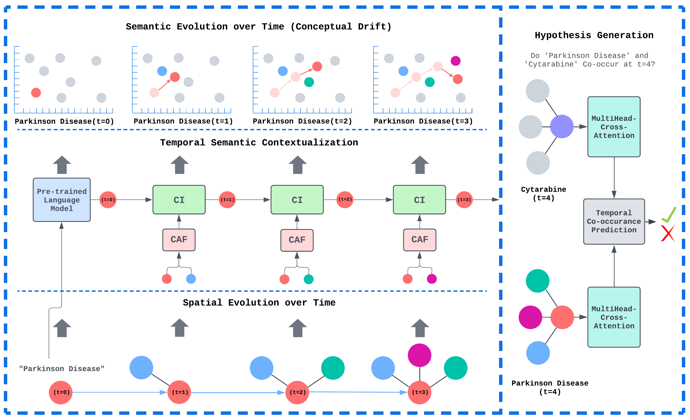

# ConceptDrift 

> We introduce a novel framework, _ConceptDrift_, that models the hypothesis generation task as a sequence of temporal graphlets and simultaneously encodes spatial, temporal, and semantic change. Unlike existing approaches that treat these dimensions independently, _ConceptDrift_ is the first to provide a holistic understanding of concept evolution by integrating them into a unified framework. Grounded in the theories of the Distributional Hypothesis and Conceptual Change, our method adapts these principles to the unique challenges of large-scale biomedical literature. We conduct extensive experiments across multiple datasets and  demonstrate that _ConceptDrift_ consistently outperforms state-of-the-art baselines in generating accurate and meaningful hypotheses. Our framework shows immediate practical benefits for web-based literature mining tools in life sciences and biomedicine, offering more robust and predictive feature representations.

- This repository holds the virology, neurology, and immunology datasets along with the implementation of ConceptDrift. 

## Data

Use [Git-LFS](https://git-lfs.com/) to ensure data.zip is downloaded. Please unzip `data.zip` in the project directory. You should have a directory named `data` in the project directory. 

Our temporal dynamic graphs are stored as Torch-Geometric [TemporalData](https://pytorch-geometric.readthedocs.io/en/2.5.0/generated/torch_geometric.data.TemporalData.html) objects. You can find a pickle files holding the datasets along with mappings from the node ids to MeSH Terms in the `data/{dataset}` folders. The biobert embeddings for the terms are also provided in the `data/{dataset}` folders. 

## System 

To ensure optimal performance and compatibility, your system should meet the following requirements:
* **Python and Library Versions**:
	* Python: Version 3.10 or higher
	* PyTorch: Version 2.0 or higher
	* Torch Geometric: Version 2.5.2 or higher
	* CUDA: Version 11.8
* **Hardware Compatibility**:
* ConceptDrift has been tested to successfully work under the following conditions:
	* CPU Systems: Single CPU with at least 32GB of RAM.
	* GPU Systems: Nvidia A40, A6000, or A100 GPU for accelerated computation.

## Environment

To ensure ConceptDrift can run properly on your system, please follow the following steps: 

1. To replicate our environment with all the necessary packages, please install the packages in `requirements.txt` in a virtual environment (e.g. [Conda](https://docs.conda.io/projects/conda/en/latest/user-guide/tasks/manage-environments.html) or [Pip](https://packaging.python.org/en/latest/guides/installing-using-pip-and-virtual-environments/) environment) before running our code.
2. Edit `src/config.ini` to include the file path to the `data` folder. 

## Training ConceptDrift

1. To train ConceptDrift, activate your environment with the necessary packages and go to the `src` folder.
2. Execute `python train.py --dataset {dataset}` to train on the `virology`, `neurology`, or `neurology` dataset. 

Hyperparameters can be adjusted with the following command line arguments:  `--batch_size ` (default is 200), `--max_epochs` (default is 2), and `--lr` (default is 0.0001).
